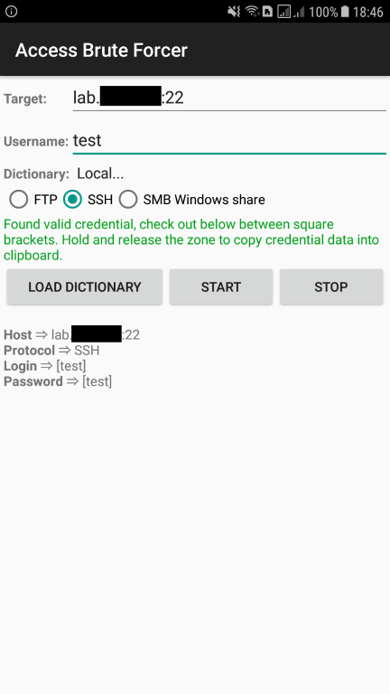

[](https://travis-ci.org/righettod/access-brute-forcer)

# SMB Access Brute Forcer

Android v7+ application to perform a dictionary brute force attack against a host exposing SMB share(s).

The application is developed using Android Studio so you can import the project into it in order to compile a APK bundle.
The application is still in development and testing.

# Motivation

This tool was developed in order to provide help in this case: During a reconnaissance phase of an authorized penetration test at network level, when a open WIFI network was identified in which hosts are connected and exposes SMB shares (see port 445 opened), the goal is to perform a quick evaluation from a smartphone (more easy to launch and hide than a laptop) of the attack surface represented by theses share(s).

The application allow to download and keep password dictionaries from predefined list of dictionaries or from the device itself (for tailored password dictionaries).

# Download

HockeyApp system is used to publish releases and track the applications crashes.

Last release: https://rink.hockeyapp.net/apps/64dd8a3981644cfd9923617dc0d05989

# Build command line

## Debug version

Use the following command line `gradlew clean cleanBuildCache assembleDebug`

## Release version

Follow these steps:

1. Create a [JKS keystore](https://stackoverflow.com/a/37488577) with a RSA keypair.
2. Create a file named **keystore.properties** at the root folder level (same location than the file `gradlew`) with the following content:
```
storePassword=[StorePassword]
keyPassword=[KeyPassword]
keyAlias=[KeyAlias]
storeFile=[Store file full location or relative location from app sub folder]
```
Example:
```
# Configuration of the keystore used to sign the released APK
storePassword=fB5YDpcvTvQH7Sg399xG49YFK
keyPassword=gHTaEq93Xe93c3rWJu8v33WVB
keyAlias=keys
storeFile=../release-keystore.jks
```
3. Use the following command line `gradlew clean cleanBuildCache assembleRelease`
4. APK is available in folder `[ROOT_FOLDER]/app/build/outputs/apk`

# Usage efficiency

The application should be combined with the following application to enhance efficiency:
* [FING](https://play.google.com/store/apps/details?id=com.overlook.android.fing&hl=en): For WIFI network discovery and target identification,
* [FILE MANAGER](https://play.google.com/store/apps/details?id=com.alphainventor.filemanager&hl=en): To access to shares content after the credentials identification.

# Action flow

1. Use **Fing** to identify a target host (copy the host IP in the clipboard),

2. Use the app to identify the credentials (paste the host IP  from the clipboard into the **Target** field),



3. Use **File Manager** to access the share contents.

# TODO

* Extend brute force to SSH, Telnet and FTP protocols.
